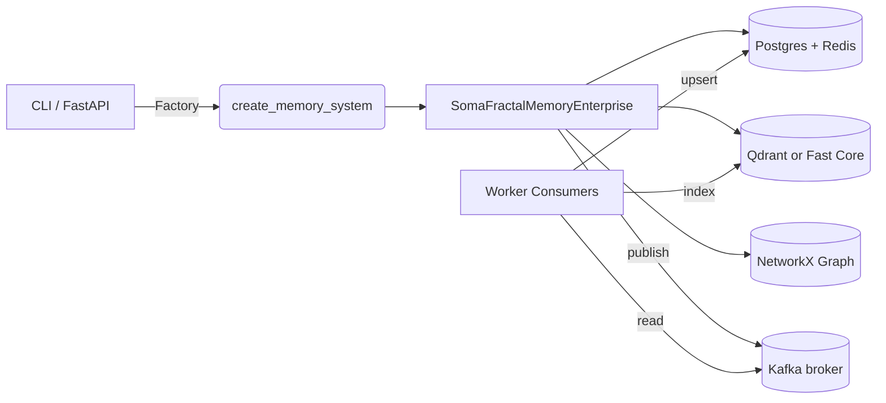

# Architecture Overview

This document provides a high-level view of **SomaFractalMemory** (SFM): the core components, how they interact, and where each concern lives in the codebase. Every component described below is backed by real implementations—no mocks or placeholders are used outside of the explicit test mode.

---

## Component Diagram (conceptual)

---

## Data Flow Narrative
1. **Entry points** – Applications call the factory from the CLI (`somafractalmemory/cli.py`) or the FastAPI service (`somafractalmemory/http_api.py`). Both paths resolve to `create_memory_system(mode, namespace, config)`.
2. **Factory wiring** – The factory inspects the requested `MemoryMode`:
   * `DEVELOPMENT` – optional Redis cache, optional Postgres backing store, Qdrant or in-memory vectors; eventing off unless explicitly enabled.
   * `TEST` – fully in-memory backends (`fakeredis` and `InMemoryVectorStore`), eventing forced off.
   * `EVENTED_ENTERPRISE` / `CLOUD_MANAGED` – Postgres + Redis hybrid KV store, Qdrant vector store, eventing enabled.
3. **Core orchestration** – `SomaFractalMemoryEnterprise` owns the public API (`store_memory`, `recall`, graph helpers, decay, bulk import/export). It:
   * Serialises payloads to the KV store (JSON-first) and writes metadata for pruning.
   * Embeds payloads using a HuggingFace transformer (falls back to hash-based vectors). Embeddings are L2-normalized.
   * Upserts vectors into Qdrant (or an in-memory store in test mode). When the `SFM_FAST_CORE` flag is enabled, a parallel flat in-process slab (contiguous float32 arrays) is appended for O(n) scan with efficient NumPy dot products, bypassing the external vector store during recall.
   * Keeps an in-memory graph via `NetworkXGraphStore` for semantic links.
   * Optionally publishes events through `eventing/producer.py` when `eventing_enabled` is true.
4. **Background work** – A decay thread prunes fields based on configured thresholds; WAL reconciliation keeps vector upserts consistent if Qdrant fails temporarily.
5. **Event consumers** – `scripts/run_consumers.py` subscribes to `memory.events`, upserts canonical records via `workers/kv_writer.py`, and indexes vectors via `workers/vector_indexer.py`. Both phases emit Prometheus metrics. The fast core slab is a purely in-process acceleration layer; events remain source-of-truth for durable indexing.
6. **Observability** – API and consumers expose Prometheus metrics; OpenTelemetry instrumentation hooks psycopg2 and Qdrant at import time; Langfuse telemetry is optional and becomes a no-op when the package is missing.

---

## Key Modules
| Concern | Location | Notes |
|---------|----------|-------|
| Core API | `somafractalmemory/core.py` | `SomaFractalMemoryEnterprise` implements storage, recall, decay, graph helpers, and bulk utilities. |
| Factory | `somafractalmemory/factory.py` | Binds concrete backends based on `MemoryMode` and exposes the `PostgresRedisHybridStore`. |
| Storage Interfaces | `somafractalmemory/interfaces/storage.py` | Contracts for key-value and vector stores used across implementations. |
| Graph Interface | `somafractalmemory/interfaces/graph.py` | Contract for graph backends; default is NetworkX. |
| Storage Implementations | `somafractalmemory/implementations/storage.py` | Redis/Postgres/Qdrant clients, plus an in-memory vector store for tests. |
| Eventing | `eventing/producer.py`, `workers/*` | Schema-validated event builder, Kafka producer, and consumer workers. |
| API Service | `somafractalmemory/http_api.py` | FastAPI surface used for local testing and documentation builds. |
| CLI | `somafractalmemory/cli.py` | Command-line interface wrapping the same factory as the API. |

---

## Production Guarantees
* **Real clients** – PostgreSQL, Redis, Qdrant, and Kafka are first-class dependencies. Test mode swaps in `fakeredis` and the in-memory vector store without altering code paths.
* **JSON-first persistence** – All payloads are serialised as JSON; legacy pickle-based storage has been removed.
* **Event schema enforcement** – Every produced message is validated against `schemas/memory.event.json`.
* **TLS/SASL hooks** – Environment variables (`POSTGRES_SSL_*`, `QDRANT_TLS`, `KAFKA_SECURITY_PROTOCOL`, etc.) are plumbed through to the respective clients.
* **Graceful degradation** – Vector failures fall back to WAL entries for later reconciliation; OpenTelemetry and Langfuse integrations quietly disable themselves when dependencies are absent.
* **Deterministic math path** – Vector embeddings are normalized; recall scoring is strictly `max(0, cosine) * importance_norm`, where `importance_norm ∈ [0,1]` is produced by an adaptive decision tree (min-max → winsor → logistic) based on the observed importance distribution (512-sample rolling reservoir). This keeps retrieval branch-free and bounded.

---

## Extensibility Points
* Implement `IVectorStore` to support an alternative ANN store (e.g., Milvus, Weaviate) and register it in the factory.
* Swap the KV layer by implementing `IKeyValueStore`; the hybrid Postgres+Redis example shows how to compose caches.
* Replace the graph backend by implementing `IGraphStore`—the default uses NetworkX, but remote graph databases can slot in.
* Extend the Kafka pipeline by adding new consumer scripts or updating `workers/vector_indexer.py`.

---

*For API surface details and configuration specifics, consult `docs/api.md` and `docs/CONFIGURATION.md`.*

---

## Runtime surfaces and canonical entrypoints

This architecture runs in two canonical ways for contributors and CI. Use Make as the single entrypoint to avoid drift between docs and code.

- Local stack (Docker Compose):
   - API: http://127.0.0.1:9595
   - Start end-to-end and wait for health: `make setup-dev`
   - Start consumer: `make compose-consumer-up`
   - Inspect ports and NodePort mappings: `make settings`

- Kubernetes dev slice (Kind + Helm):
   - Dev service port 9797 exposed via NodePort 30797 on host (primary API at 9595 remains unchanged)
   - Install and verify: `make setup-dev-k8s` then `make helm-dev-health`
   - Default ClusterIP port remains 9595 inside the cluster; use port-forward helper if not using the dev NodePort

Related documentation:
- Developer Environment: `docs/DEVELOPER_ENVIRONMENT.md` (step-by-step, diagrams)
- Developer Guide: `docs/DEVELOPER_GUIDE.md` (day-to-day workflows)
- Canonical Documentation: `docs/CANONICAL_DOCUMENTATION.md` (operational source of truth)

---

## Event pipeline and vector indexing specifics

- Producer (API/core): publishes validated `memory.events` with deterministic IDs and ISO8601 timestamps.
- Consumers:
   - `workers/kv_writer.py` upserts canonical JSON rows into Postgres (`memory_events`).
   - `workers/vector_indexer.py` generates deterministic hash-based embeddings aligned with core’s fallback (blake2b → float32 → L2-normalize) and indexes into:
      - The default collection (env `$QDRANT_COLLECTION`, defaults to `memory_vectors`).
      - The namespace-named collection when a `namespace` field is present.
      - An optional extra collection when `$QDRANT_EXTRA_COLLECTION` is set (useful for tests).

Tests verify presence via a payload filter on `task` and probe multiple collections (`$QDRANT_COLLECTION`, `memory_vectors`, `default`, `api_ns`) to avoid flakiness due to scroll order or mixed collections.
