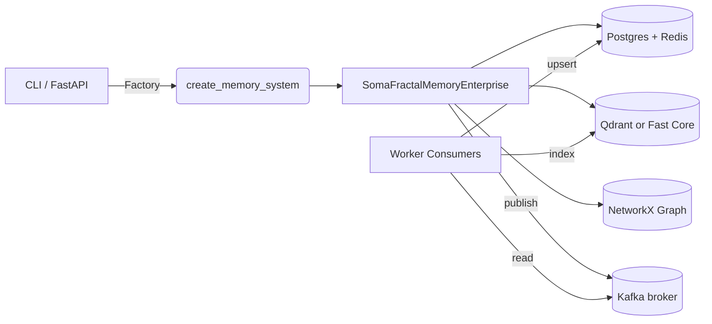

# Architecture Overview

This document provides a high-level view of **SomaFractalMemory** (SFM): the core components, how they interact, and where each concern lives in the codebase. Every component described below is backed by real implementations—no mocks or placeholders are used outside of the explicit test mode.

---

## Component Diagram (conceptual)

---

## Data Flow Narrative
1. **Entry points** – Applications call the factory from the CLI (`somafractalmemory/cli.py`) or the FastAPI service (`somafractalmemory/http_api.py`). Both paths resolve to `create_memory_system(mode, namespace, config)`.
2. **Factory wiring** – The factory always resolves to `MemoryMode.EVENTED_ENTERPRISE`. Configuration toggles (for example `redis.testing=True` or `vector.backend="memory"`) can swap specific backends to in-memory implementations for tests, but the mode itself never changes.
3. **Core orchestration** – `SomaFractalMemoryEnterprise` owns the public API (`store_memory`, `recall`, graph helpers, decay, bulk import/export). It:
   * Serialises payloads to the KV store (JSON-first) and writes metadata for pruning.
   * Embeds payloads using a HuggingFace transformer (falls back to hash-based vectors). Embeddings are L2-normalized.
   * Upserts vectors into Qdrant (or an in-memory store in test mode). When the `SFM_FAST_CORE` flag is enabled, a parallel flat in-process slab (contiguous float32 arrays) is appended for O(n) scan with efficient NumPy dot products, bypassing the external vector store during recall.
   * Keeps an in-memory graph via `NetworkXGraphStore` for semantic links.
   * Optionally publishes events through `eventing/producer.py` when `eventing_enabled` is true.
4. **Background work** – A decay thread prunes fields based on configured thresholds; WAL reconciliation keeps vector upserts consistent if Qdrant fails temporarily.
5. **Event consumers** – `scripts/run_consumers.py` subscribes to `memory.events`, upserts canonical records via `workers/kv_writer.py`, and indexes vectors via `workers/vector_indexer.py`. Both phases emit Prometheus metrics. The fast core slab is a purely in-process acceleration layer; events remain source-of-truth for durable indexing.
6. **Observability** – API and consumers expose Prometheus metrics; OpenTelemetry instrumentation hooks psycopg2 and Qdrant at import time; Langfuse telemetry is optional and becomes a no-op when the package is missing.

---

## Key Modules
| Concern | Location | Notes |
|---------|----------|-------|
| Core API | `somafractalmemory/core.py` | `SomaFractalMemoryEnterprise` implements storage, recall, decay, graph helpers, and bulk utilities. |
| Factory | `somafractalmemory/factory.py` | Binds concrete backends based on `MemoryMode` and exposes the `PostgresRedisHybridStore`. |
| Storage Interfaces | `somafractalmemory/interfaces/storage.py` | Contracts for key-value and vector stores used across implementations. |
| Graph Interface | `somafractalmemory/interfaces/graph.py` | Contract for graph backends; default is NetworkX. |
| Storage Implementations | `somafractalmemory/implementations/storage.py` | Redis/Postgres/Qdrant clients, plus an in-memory vector store for tests. |
| Eventing | `eventing/producer.py`, `workers/*` | Schema-validated event builder, Kafka producer, and consumer workers. |
| API Service | `somafractalmemory/http_api.py` | FastAPI surface used for local testing and documentation builds. |
| CLI | `somafractalmemory/cli.py` | Command-line interface wrapping the same factory as the API. |

---

## Component Inventory
| Layer | Responsibilities | Code anchors | Operational notes |
|-------|------------------|--------------|-------------------|
| **Ingress** | FastAPI, CLI, and async gRPC server all invoke the enterprise runtime. | `somafractalmemory/http_api.py`, `somafractalmemory/cli.py`, `somafractalmemory/async_grpc_server.py` | HTTP surface enforces bearer auth & rate limiting; gRPC exposes the same metrics/health checks. |
| **Configuration** | Load and validate settings, wire concrete stores. | `common/config/settings.py`, `somafractalmemory/factory.py` | `MemoryMode.EVENTED_ENTERPRISE` is enforced; invalid modes raise before runtime wiring. |
| **Enterprise core** | Store/recall flows, decay, export/import, WAL reconciliation, graph helpers. | `somafractalmemory/core.py` | Maintains adaptive importance normaliser and sliceable hooks for before/after store & recall. |
| **Persistence** | Durable KV + cache, vector storage, graph metadata. | `somafractalmemory/implementations/storage.py`, `somafractalmemory/implementations/graph.py` | Postgres remains canonical; Redis is optional (falls back to Postgres locks); Qdrant can be swapped for the in-memory vector store in tests. |
| **Event pipeline** | Publish memory events and consume them for durable indexing. | `eventing/producer.py`, `workers/kv_writer.py`, `workers/vector_indexer.py` | Events validated against `schemas/memory.event.json`; consumers dedupe via deterministic IDs. |
| **Observability** | Metrics, tracing, structured logging, rate limiting. | `somafractalmemory/http_api.py`, `scripts/run_consumers.py`, `common/utils/logger.py` | Prometheus `/metrics`; OTEL exporters optional; Redis-backed rate limiter downgrades gracefully to in-memory buckets. |

---

## Production Guarantees
* **Real clients** – PostgreSQL, Redis, Qdrant, and Kafka are first-class dependencies. Test configurations swap in `fakeredis` and the in-memory vector store without altering code paths.
* **JSON-first persistence** – All payloads are serialised as JSON; legacy pickle-based storage has been removed.
* **Event schema enforcement** – Every produced message is validated against `schemas/memory.event.json`.
* **Automatic port conflict resolution** – Infrastructure ports are automatically assigned when conflicts are detected, ensuring zero-conflict deployments across environments.
* **TLS/SASL hooks** – Environment variables (`POSTGRES_SSL_*`, `QDRANT_TLS`, `KAFKA_SECURITY_PROTOCOL`, etc.) are plumbed through to the respective clients.
* **Graceful degradation** – Vector failures fall back to WAL entries for later reconciliation; OpenTelemetry and Langfuse integrations quietly disable themselves when dependencies are absent.
* **Deterministic math path** – Vector embeddings are normalized; recall scoring is strictly `max(0, cosine) * importance_norm`, where `importance_norm ∈ [0,1]` is produced by an adaptive decision tree (min-max → winsor → logistic) based on the observed importance distribution (512-sample rolling reservoir). This keeps retrieval branch-free and bounded.

---

## Critical Invariants
1. **Namespace isolation** – Namespaces are embedded in every storage key (`{namespace}:{coord}`) and Qdrant collection. Consumers replay events into the same namespace, preventing accidental tenant bleed.
2. **Authenticated writes** – FastAPI import fails when `SOMA_API_TOKEN` (or `SOMA_API_TOKEN_FILE`) is missing. CLI users pass tokens when calling remote APIs; health/metrics endpoints intentionally remain unauthenticated.
3. **At-least-once delivery** – Kafka events use deterministic IDs. Consumers upsert into Postgres, making replays idempotent. WAL reconciliation guarantees eventual vector convergence.
4. **Schema stability** – Event payloads must conform to `schemas/memory.event.json`; changes require coordinated producer/consumer releases and schema version bumps.
5. **Resilient rate limiting** – Redis-backed limiter downgrades to in-memory buckets when Redis is unavailable so write paths continue to function.

---

## Request Lifecycle Deep Dive
1. **Store path**
   - Authorization + rate limit dependencies run before handler logic.
   - Payload persisted to Postgres (and optionally Redis cache) inside the enterprise core transaction.
   - Qdrant upsert executed synchronously; failures persist a WAL entry and raise to the caller.
   - Event emitted to Kafka; reconciliation workers re-apply failed vector upserts.
2. **Recall path**
   - Query embedded via transformer or hash fallback.
   - Hybrid scorer merges vector scores, keyword matches (Postgres trigram), and adaptive importance boosts.
   - Results return coordinates, payload snippets, optional scores, and graph metadata on demand.
3. **Decay & pruning**
   - Background thread evaluates configured decayable keys and `max_memory_size`, pruning low-importance or stale entries.
4. **Reconciliation**
   - WAL entries replay periodically (or via `_reconcile_once`) ensuring vector store parity even after transient outages.

---

## Extensibility Points
* Implement `IVectorStore` to support an alternative ANN store (e.g., Milvus, Weaviate) and register it in the factory.
* Swap the KV layer by implementing `IKeyValueStore`; the hybrid Postgres+Redis example shows how to compose caches.
* Replace the graph backend by implementing `IGraphStore`—the default uses NetworkX, but remote graph databases can slot in.
* Extend the Kafka pipeline by adding new consumer scripts or updating `workers/vector_indexer.py`.

---

*For API surface details and configuration specifics, consult `docs/api.md` and `docs/CONFIGURATION.md`.*

---

## Runtime surfaces and canonical entrypoints

This architecture runs in multiple canonical modes for contributors and CI. We use Docker Compose profiles with automatic port assignment to avoid conflicts:

- Local stack (Docker Compose — profile driven with automatic port assignment):
   - Core (recommended developer local‑prod): starts the minimal, real E2E pipeline required for integration testing and development: API, Consumer, Kafka (KRaft), Postgres, Redis and Qdrant.
      - Start (automatic port assignment): `./scripts/assign_ports_and_start.sh` or `make setup-dev`
      - Start (manual): `docker compose --profile core up -d`
      - Stop: `docker compose --profile core down`
      - **Port Assignment**: Memory API fixed on 9595, all infrastructure ports auto-assigned to avoid conflicts
   - Shared infra (external/shared infra for multi‑project development): starts only the infra components (Kafka/Postgres/Redis/Qdrant) on a shared network so multiple apps can attach to the same infra.
      - Start: `docker compose --profile shared up -d`
   - Consumer only (when you want to run workers without the API locally):
      - Start: `docker compose --profile consumer up -d somafractalmemory_kube`
   - Monitoring (opt‑in): Prometheus & Grafana are behind the `monitoring` profile and are not started by default.
      - Start: `docker compose --profile monitoring up -d`
   - Ops (opt‑in): Vault, Etcd, OPA and other operational services are behind the `ops` profile and are started only when explicitly requested.

   Notes:
   - Kafka runs in KRaft mode (no Zookeeper). The canonical Compose uses a KRaft configuration (controller + broker roles) so the full eventing pipeline uses real brokers without Zookeeper.
   - Use the `shared` profile when you want a single infra footprint reused by multiple application instances (recommended for heavier local dev machines or CI nodes).
   - Host port exposure for Kafka (OUTSIDE listener) is optional and only required if you need to talk to the broker from the host; tests that run inside containers should use the internal `kafka:9092` address.

   ### Docker modes (explicit)

   To make deployment modes unambiguous, we explicitly call out two Docker-first modes developers and operators should use.

   - LOCAL DEV FULL
      - Purpose: self-contained local development environment that brings up the API, consumers, and all infra (Kafka, Postgres, Redis, Qdrant) on the developer's machine.
      - Behavior: Memory API is fixed to host port 9595. All infrastructure host ports (Postgres, Redis, Qdrant, Kafka) are automatically assigned if the defaults are occupied. The chosen host ports are written to `.env` by the startup helper so other local tooling can pick them up.
      - Typical command(s):
         - `make setup-dev`  # canonical one-liner (auto-assign ports, build images, start stack, wait for health)
         - `./scripts/assign_ports_and_start.sh`  # lower-level helper that writes `.env` and starts the compose stack
         - or `docker compose --profile core up -d` (manual; use only when you want to control which services start)
      - Quick checks:
         - `cat .env` to view assigned host ports
         - `make settings` or `make compose-print-ports` to print endpoints
         - API URL (always): `http://127.0.0.1:9595`

   - LOCAL SHARED PROD
      - Purpose: run only the shared infrastructure on the host (Kafka/Postgres/Redis/Qdrant) so multiple projects or multiple app instances can reuse the same infra footprint. This is useful on powerful developer machines or CI nodes where infra should persist independently from any single app instance.
      - Behavior: infra services are started on a shared Docker network (the repo uses `soma_docker_shared_infra_soma-network` by default). Applications can be started separately and connect to those services by service name. Memory API still expects to be reachable at port 9595 (start the API container in app-only mode or via Helm/Kind as appropriate).
      - Typical command(s):
         - `docker compose --profile shared up -d`  # starts shared infra
         - Start the API separately (app-only) once infra is up: `docker compose --profile core up -d api` or use Helm/Kind for app-only deployments
      - Quick checks:
         - `docker network ls` to confirm the shared network exists
         - `docker compose --profile shared ps` to see infra containers
         - Use `KAFKA_BOOTSTRAP_SERVERS`, `POSTGRES_URL`, `QDRANT_URL` exported from `.env` or provided to the app container so it connects to the shared infra

   Notes:
   - In both modes the Memory API port is treated as the canonical, stable entrypoint and must remain 9595 to preserve CI and tooling assumptions.
   - For transient troubleshooting or tests, use `docker compose down -v` to wipe named volumes; for normal stop/start keep volumes to preserve data.

- Kubernetes dev slice (Kind + Helm):
   - Dev service port 9797 exposed via NodePort 30797 on host (primary API at 9595 remains unchanged)
   - Install and verify: `make setup-dev-k8s` then `make helm-dev-health`
   - Default ClusterIP port remains 9595 inside the cluster; use port-forward helper if not using the dev NodePort

Related documentation:
- Developer Environment: `docs/DEVELOPER_ENVIRONMENT.md` (step-by-step, diagrams)
- Developer Guide: `docs/DEVELOPER_GUIDE.md` (day-to-day workflows)
- Canonical Documentation: `docs/CANONICAL_DOCUMENTATION.md` (operational source of truth)

---

## Event pipeline and vector indexing specifics

- Producer (API/core): publishes validated `memory.events` with deterministic IDs and ISO8601 timestamps.
- Consumers:
   - `workers/kv_writer.py` upserts canonical JSON rows into Postgres (`memory_events`).
   - `workers/vector_indexer.py` generates deterministic hash-based embeddings aligned with core’s fallback (blake2b → float32 → L2-normalize) and indexes into:
      - The default collection (env `$QDRANT_COLLECTION`, defaults to `memory_vectors`).
      - The namespace-named collection when a `namespace` field is present.
      - An optional extra collection when `$QDRANT_EXTRA_COLLECTION` is set (useful for tests).

Tests verify presence via a payload filter on `task` and probe multiple collections (`$QDRANT_COLLECTION`, `memory_vectors`, `default`, `api_ns`) to avoid flakiness due to scroll order or mixed collections.
