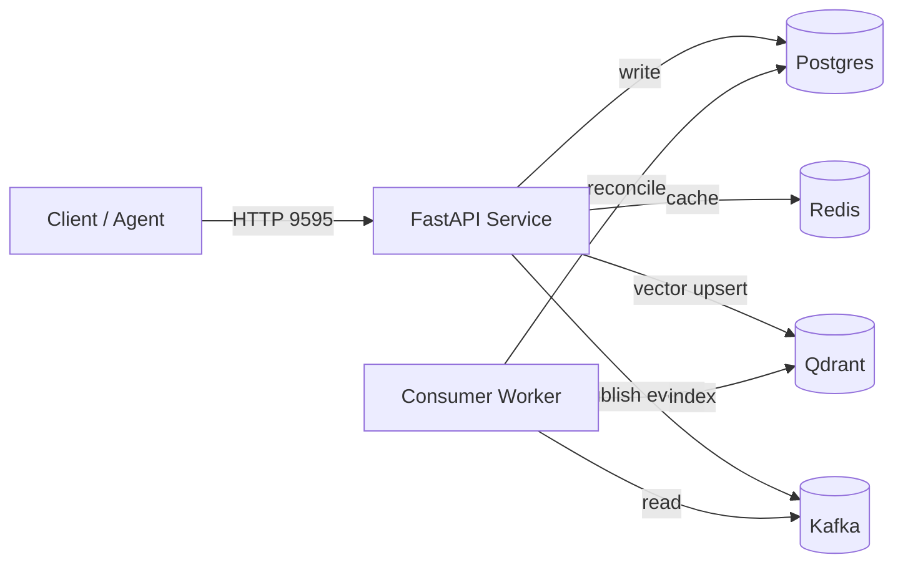

# SomaFractalMemory – Developer Guide

This guide is aimed at contributors working directly with the codebase. It complements the canonical operations document with day-to-day workflows, pointers to key modules, and troubleshooting tips grounded in the current implementation.

---

## Table of Contents
- [Project Layout](#project-layout)
- [Bootstrapping a Dev Environment](#bootstrapping-a-dev-environment)
- [Running Services](#running-services)
- [CLI & API Usage](#cli--api-usage)
- [Testing & Static Analysis](#testing--static-analysis)
- [Cleaning Up](#cleaning-up)
- [Troubleshooting](#troubleshooting)

---

## Project Layout
| Path | Purpose |
|------|---------|
| `somafractalmemory/` | Core library (factory, enterprise class, interfaces, implementations, CLI). |
| `somafractalmemory/http_api.py` | FastAPI service used for local runs and OpenAPI generation. |
| `somafractalmemory/grpc_server.py` | gRPC server for high-performance communication. |
| `eventing/` | Kafka event producer and schema definition. |
| `workers/` | Consumers that reconcile events into Postgres/Qdrant. |
| `scripts/` | Operational helpers (`assign_ports_and_start.sh`, etc.). |
| `docs/` | MkDocs source files (kept in sync with the codebase). |
| `tests/` | Unit and integration tests. |

---

## Bootstrapping a Dev Environment

1. **Verify prerequisites** – ensure `docker`, `docker compose`, `python3`, and `curl` are on your `PATH`:
   ```bash
   docker --version
   docker compose version
   python3 --version
   curl --version
   ```

2. **Clone and enter the repository**:
   ```bash
   git clone https://github.com/somatechlat/somafractalmemory.git
   cd somafractalmemory
   ```

3. **Create an isolated Python toolchain** – we default to Astral’s `uv` for reproducible installs:
   ```bash
   curl -LsSf https://astral.sh/uv/install.sh | sh -s -- -y
   uv sync --extra api --extra events --extra dev
   ```
   `uv sync` resolves and installs all project extras (API, eventing, developer tooling) into `.venv`. Use `uv run …` to execute commands without “activating” the environment manually.

   Fallback (classic venv + pip):
   ```bash
   python3 -m venv .venv
   source .venv/bin/activate
   pip install -e .[api,events,dev]
   ```

4. **Install git hooks** to mirror CI checks locally:
   ```bash
   uv run pre-commit install
   ```

---

## Running Services

The recommended way to run the full stack locally is with the automatic port assignment script, which avoids conflicts with other services.

### One-Command Zero-Conflict Deployment
```bash
# Automatic port assignment with conflict resolution
./scripts/assign_ports_and_start.sh

# OR use make target
make setup-dev
```

This will start the entire stack, including the API, consumer, and all infrastructure services (PostgreSQL, Redis, Qdrant, Kafka).

### Full Stack Topology


### Manual Docker Compose Commands
If you need more granular control, you can use `docker compose` directly with profiles:
- **Start core services**: `docker compose --profile core up -d`
- **Start consumer**: `docker compose --profile consumer up -d`
- **Check health**: `make compose-health`
- **View logs**: `make compose-logs`
- **Stop services**: `make compose-down` (keeps data) or `make compose-down-v` (removes data)

---

## CLI & API Usage
### CLI (`soma`)
The CLI wraps `create_memory_system` and exposes commands for storing, recalling, and exporting memories. Example:
```bash
uv run soma --mode evented_enterprise --namespace cli_demo store \
  --coord "1,2,3" \
  --payload '{"task": "triage", "importance": 3}'
```

### FastAPI Example
Run the example app directly for rapid iteration:
```bash
uvicorn somafractalmemory.http_api:app --reload
```
The API will be available at `http://localhost:9595`, with interactive documentation at `http://localhost:9595/docs`.

---

## Testing & Static Analysis
| Command | What it does |
|---------|---------------|
| `uv run pytest -q` | Runs the fast suite (unit + lightweight integration). |
| `USE_REAL_INFRA=1 uv run pytest -q` | Runs the full suite against the live Docker Compose services. |
| `uv run ruff check .` | Linting (mirrors CI). |
| `uv run black --check .` | Formatting check. |
| `uv run bandit -q -r somafractalmemory` | Security scan of the library. |
| `uv run mypy somafractalmemory` | Static type checking. |
| `uv run mkdocs build` | Validates that documentation builds successfully. |

---

## Cleaning Up
- Stop containers and keep data: `docker compose down`
- Stop and purge data volumes: `docker compose down -v`
- Remove the local Qdrant database used by tests or quickstarts: `rm -rf qdrant.db`

---

## Troubleshooting
**Port conflicts** – Use `./scripts/assign_ports_and_start.sh` to avoid port conflicts automatically.

**Redis connection errors during development** – If you only need in-memory mode, set `REDIS_HOST=localhost` and `redis.testing=true` in your config to force `fakeredis`.

**Integration tests use existing services** – With `USE_REAL_INFRA=1`, tests reuse the running Docker Compose stack; ensure it is healthy before running.

---

*Refer back to `docs/ARCHITECTURE.md` for a detailed architectural overview and `docs/api.md` for method-level details.*
