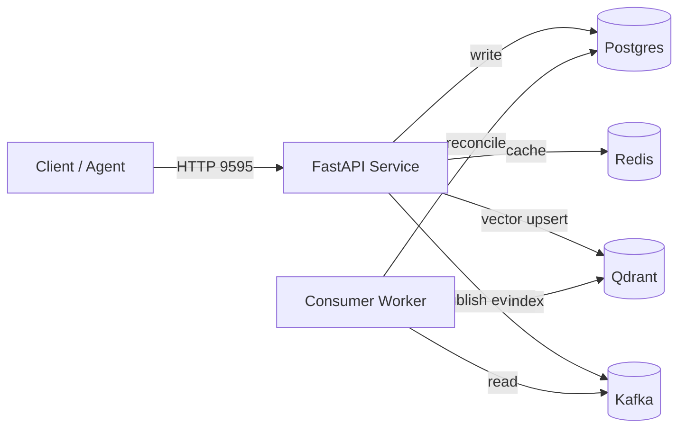

# SomaFractalMemory – Developer Guide

This guide is aimed at contributors working directly with the codebase. It complements the canonical operations document with day-to-day workflows, pointers to key modules, and troubleshooting tips grounded in the current implementation.

---

## Table of Contents
- [Project Layout](#project-layout)
- [Bootstrapping a Dev Environment](#bootstrapping-a-dev-environment)
- [Running Services](#running-services)
- [CLI & API Usage](#cli--api-usage)
- [Testing & Static Analysis](#testing--static-analysis)
- [Cleaning Up](#cleaning-up)
- [Troubleshooting](#troubleshooting)

---

## Project Layout
| Path | Purpose |
|------|---------|
| `somafractalmemory/` | Core library (factory, enterprise class, interfaces, implementations, CLI). |
| `examples/api.py` | FastAPI example used for local runs and OpenAPI generation. |
| `eventing/` | Kafka event producer and schema definition. |
| `workers/` | Consumers that reconcile events into Postgres/Qdrant. |
| `scripts/` | Operational helpers (`start_stack.sh`, `run_consumers.py`, etc.). |
| `docs/` | MkDocs source files (kept in sync with the codebase). |
| `tests/` | Unit and integration tests. |

---

## Bootstrapping a Dev Environment

1. **Verify prerequisites** – ensure `docker`, `docker compose`, `python3`, and `curl` are on your `PATH`:
   ```bash
   docker --version
   docker compose version
   python3 --version
   curl --version
   ```
   If any command is missing, follow the installation guidance in `docs/DEVELOPER_ENVIRONMENT.md` before continuing.

2. **Clone and enter the repository**:
   ```bash
   git clone https://github.com/somatechlat/somafractalmemory.git
   cd somafractalmemory
   ```

3. **Create an isolated Python toolchain** – we default to Astral’s `uv` for reproducible installs:
   ```bash
   curl -LsSf https://astral.sh/uv/install.sh | sh -s -- -y
   uv sync --extra api --extra events --extra dev
   ```
   `uv sync` resolves and installs all project extras (API, eventing, developer tooling) into `.venv`. Use `uv run …` to execute commands without “activating” the environment manually.

   Fallback (classic venv + pip):
   ```bash
   python3 -m venv .venv
   source .venv/bin/activate
   pip install -e .[api,events,dev]
   ```

4. **Install git hooks** to mirror CI checks locally:
   ```bash
   uv run pre-commit install
   ```

---

## Running Services

SomaFractalMemory exposes two local workflows: the **full Docker Compose stack** and a **scripted lightweight stack**. Most contributors should start with Docker Compose, which mirrors CI and integration test expectations.

### Full Stack Topology


### Docker Compose (evented enterprise stack)

Follow these steps every time you want a clean local cluster:

1. **Build or refresh images** (only required after changing Python code or dependencies):
   ```bash
   docker compose build
   ```

2. **Start the core services** (API, Kafka, Postgres, Redis, Qdrant):
   ```bash
   docker compose up -d
   ```

3. **Tail logs until the API reports ready** – this waits for Kafka and database connectivity before proceeding:
   ```bash
   docker compose logs -f api
   ```
   Look for `Application startup complete.`. Press `Ctrl+C` to stop tailing; containers keep running.

4. **(Optional) Start the consumer profile** if you need asynchronous reconciliation:
   ```bash
   docker compose --profile consumer up -d somafractalmemory_kube
   ```

5. **Validate the cluster**:
   ```bash
   curl -s http://localhost:9595/healthz | jq .
   curl -s http://localhost:9595/readyz | jq .
   docker compose exec postgres pg_isready -U postgres
   curl -s http://localhost:6333/metrics >/dev/null
   ```
   A `true` response from `/healthz` and `/readyz` confirms API readiness. `pg_isready` should reply `accepting connections`.

6. **Stop services when finished**:
   ```bash
   docker compose down           # keep volumes
   docker compose down -v        # remove volumes/data
   ```

Fixed host ports (aligns with test fixtures and examples):
- API: `http://localhost:9595`
- Postgres: `localhost:5433`
- Redis: `localhost:6381`
- Qdrant: `localhost:6333`
- Kafka (external listener): `localhost:19092`

Declarative configuration lives in `docker-compose.yml`. Override values ad hoc with `docker compose up -d api -e MEMORY_MODE=development` or by creating a `.env` file; environment variables take precedence over defaults baked into the compose file.

### Minimal backends via `start_stack.sh`

Use this path when you only need the API plus storage without Kafka:
```bash
./scripts/start_stack.sh development                 # Postgres + Qdrant
./scripts/start_stack.sh development --with-broker   # Adds Kafka
./scripts/start_stack.sh evented_enterprise          # Full parity with compose
```
The script prints connection strings for each component. After it completes, run the example API with auto‑reload:
```bash
uv run uvicorn examples.api:app --reload --host 0.0.0.0 --port 9595
```

---

## CLI & API Usage
### CLI (`soma`)
The CLI wraps `create_memory_system` and exposes commands for storing, recalling, and exporting memories. Example:
```bash
soma --mode development --namespace cli_demo store \
  --coord "1,2,3" \
  --payload '{"task": "triage", "importance": 3}'
```
Supply `--config-json` to point at a JSON file mirroring the `config` dictionary structure (`redis`, `postgres`, `qdrant`, `eventing`, `memory_enterprise`).

### FastAPI Example
Run the example app directly for rapid iteration:
```bash
uvicorn examples.api:app --reload
```
On startup it:
- Creates a development-mode memory system (`redis.testing=True`, Qdrant pointed at the configured host/port).
- Generates `openapi.json` in the repository root.
- Publishes Prometheus metrics and rate limits using environment defaults.

Important endpoints: `/store`, `/recall`, `/remember`, `/store_bulk`, `/link`, `/neighbors`, `/shortest_path`, `/stats`, `/metrics`, `/healthz`, `/readyz`.

---

## Testing & Static Analysis
| Command | What it does |
|---------|---------------|
| `uv run pytest -q` | Runs the fast suite (unit + lightweight integration) – in-memory / fakeredis paths where applicable. |
| `USE_REAL_INFRA=1 uv run pytest -q` | Runs the full suite against the live Docker Compose services (Kafka, Postgres, Redis, Qdrant). |
| `uv run pytest -m integration -q` | Run only tests marked as requiring real infra (ensure `USE_REAL_INFRA=1` and stack is up). |
| `uv run pytest tests/test_full_stack_enterprise_round_trip.py -q` | End‑to‑end persistence test (KV + vector + WAL absence + locks). |
| `uv run pytest tests/test_kafka_event_flow.py -q -m integration` | Verifies Kafka events are emitted & consumable (EVENTED_ENTERPRISE). |
| `uv run ruff check .` | Linting (mirrors CI). |
| `uv run black --check .` | Formatting check. |
| `uv run bandit -q -r somafractalmemory` | Security scan of the library. |
| `uv run mypy somafractalmemory` | Static type checking. |
| `uv run mkdocs build` | Validates that documentation builds successfully. |

### Real Infra Test Mode
Setting `USE_REAL_INFRA=1` signals fixtures to bind directly to the running Docker Compose services instead of launching ephemeral testcontainers. Export it once in your shell to keep the behaviour consistent:
```bash
export USE_REAL_INFRA=1
```
Unset the variable to fall back to testcontainers (requires Docker socket access). The suite filters most third‑party deprecation warnings automatically.

### Runtime vs Development Images
The default `Dockerfile` is development-oriented (includes tests, docs, build toolchain). For
Kubernetes/Helm or slimmer production packaging use the multi-stage runtime image:
```bash
docker build -f Dockerfile.runtime -t somafractalmemory-runtime:local .
```
Helm `values.yaml` can then reference `somafractalmemory-runtime` for both API and consumer components.

All of the above run automatically in GitHub Actions (`.github/workflows/ci.yml`).

---

## Cleaning Up
- Stop containers and keep data: `docker compose down`
- Stop and purge data volumes: `docker compose down -v`
- Remove the local Qdrant database used by tests or quickstarts: `rm -rf qdrant.db`
- Reset the environment file: re-copy `.env.example`

---

## Troubleshooting
**Postgres port conflicts** – The compose files expose Postgres on `5433`; ensure `.env` references that port when connecting from the host.

**Redis connection errors during development** – If you only need in-memory mode, set `REDIS_HOST=localhost` and `redis.testing=true` in your config to force `fakeredis`.

**Kafka optional for some modes** – Set `EVENTING_ENABLED=false` and avoid running the consumer if you only need synchronous store/recall APIs. For full enterprise coverage (vector + event reconciliation) leave it enabled.

**Integration tests use existing services** – With `USE_REAL_INFRA=1`, tests reuse the running Postgres/Redis/Qdrant/Kafka instead of spinning up disposable containers; ensure compose stack is healthy before running.

**OpenTelemetry warnings** – When the collector endpoint is absent, set `OTEL_TRACES_EXPORTER=none` to silence connection errors.

---

*Refer back to `docs/CANONICAL_DOCUMENTATION.md` for deployment-focused instructions and `docs/api.md` for method-level details.*
