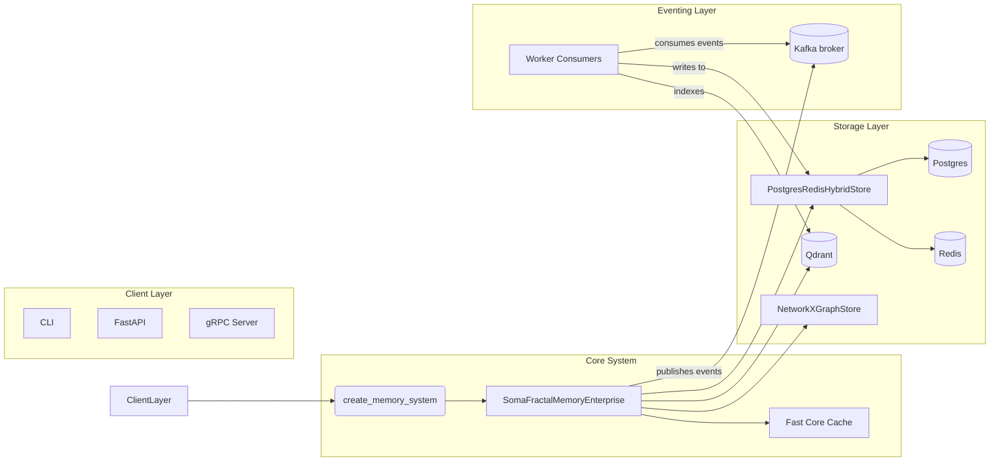
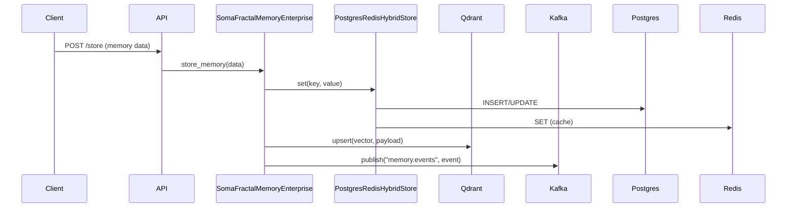
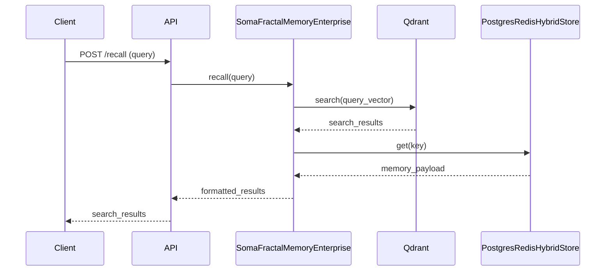
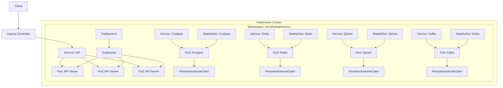

# Soma Fractal Memory - Developer User Manual

---

## 1. Introduction
*This section will provide a high-level overview of the project's vision, goals, and core concepts.*

## 2. System Architecture
*This section will offer a deep dive into the system's design, complete with detailed diagrams.*

### 2.1. Core Components

The Soma Fractal Memory system is designed with a clean, decoupled architecture, following the principles of Dependency Inversion and Dependency Injection.

- **`SomaFractalMemoryEnterprise`**: This is the central class of the system, located in `somafractalmemory/core.py`. It contains the core business logic for all memory operations but is completely decoupled from any specific storage technology. It operates entirely on the abstract interfaces defined in `somafractalmemory/interfaces/`.

- **Storage Interfaces**: These are the abstract base classes that define the contract for the storage layer:
    - `IKeyValueStore`: Defines the methods for a key-value store.
    - `IVectorStore`: Defines the methods for a vector store.
    - `IGraphStore`: Defines the methods for a graph store.

- **Storage Implementations**: These are the concrete implementations of the storage interfaces:
    - `PostgresRedisHybridStore`: Implements `IKeyValueStore` using PostgreSQL and Redis.
    - `QdrantVectorStore`: Implements `IVectorStore` using Qdrant.
    - `NetworkXGraphStore`: Implements `IGraphStore` using NetworkX.

- **`factory.py` (Dependency Injection Container)**: The `create_memory_system` function in `somafractalmemory/factory.py` acts as a pure Dependency Injection (DI) container. Its sole responsibility is to instantiate the concrete storage implementations and "inject" them into the `SomaFractalMemoryEnterprise` constructor. This decouples the core logic from the creation of its dependencies.

### 2.2. System Architecture Diagram

The following diagram provides a high-level overview of the system's architecture and the interactions between its components.



### 2.3. Data Flow for `store` Operations

The following sequence diagram illustrates the process of storing a new memory in the system.



### 2.4. Data Flow for `recall` Operations

The following sequence diagram illustrates the process of recalling a memory from the system.



### 2.5. "Fast Core" In-Memory Cache
*An in-depth look at the Fast Core feature for accelerated recall.*

## 3. Getting Started

This section provides a step-by-step guide to setting up a local development environment for Soma Fractal Memory.

### 3.1. Prerequisites
Before you begin, ensure you have the following tools installed on your system:
- Docker
- Docker Compose
- Python 3.10+
- `curl`

### 3.2. Environment Setup
1.  **Clone the repository**:
    ```bash
    git clone https://github.com/somatechlat/somafractalmemory.git
    cd somafractalmemory
    ```

2.  **Install Python dependencies**:
    This project uses `uv` to manage Python dependencies. To install `uv` and the project's dependencies, run:
    ```bash
    curl -LsSf https://astral.sh/uv/install.sh | sh -s -- -y
    uv sync --extra api --extra events --extra dev
    ```

3.  **Install pre-commit hooks**:
    To ensure your code adheres to the project's style guidelines, install the pre-commit hooks:
    ```bash
    uv run pre-commit install
    ```

## 4. Development Workflows

This section covers the common tasks you will perform during development.

### 4.1. Running the Application
The recommended way to run the full application stack is with Docker Compose:
```bash
make compose-up
```
This will start all the necessary services. By default, the services will be exposed on their standard ports. If you need to avoid port conflicts, you can set environment variables before running the command:
```bash
export POSTGRES_HOST_PORT=5434
make compose-up
```

### 4.2. Using the CLI
The project includes a command-line interface (CLI) for interacting with the memory system. To see the available commands, run:
```bash
uv run soma --help
```

### 4.3. Running Tests
To run the test suite, use the following command:
```bash
uv run pytest
```
To run the tests against a real infrastructure stack (instead of in-memory test doubles), set the `USE_REAL_INFRA=1` environment variable:
```bash
USE_REAL_INFRA=1 uv run pytest
```

### 4.4. Static Analysis
To run the static analysis tools (linting, type checking, etc.), use the following commands:
- **Ruff (linting)**: `uv run ruff check .`
- **Black (formatting)**: `uv run black .`
- **MyPy (type checking)**: `uv run mypy somafractalmemory`

## 5. Deployment Guide

This section provides a comprehensive guide to deploying the Soma Fractal Memory application.

### 5.1. Local Deployment with Docker Compose
For local development and testing, the project uses Docker Compose to manage the application stack. The configuration is defined in the `docker-compose.yml` file.

**To start the application:**
```bash
make compose-up
```

**To stop the application:**
```bash
make compose-down
```

### 5.2. Kubernetes Deployment with Helm
For deploying to Kubernetes, the project includes a Helm chart in the `helm/` directory. The chart supports two deployment profiles:

- **`local-dev`**: A lightweight configuration for local Kubernetes clusters.
- **`prod-ha`**: A high-availability configuration for production environments.

**To deploy for local development:**
```bash
make helm-install-local-dev
```

**To deploy for production:**
```bash
make helm-install-prod-ha
```

### 5.3. Kubernetes Deployment Diagram

The following diagram illustrates the architecture of the Kubernetes deployment.



## 6. Advanced Topics

### 6.1. Configuration Management
The application's configuration is managed through a combination of environment variables and the `common/config/settings.py` file. For a detailed list of all configuration options, please refer to the `docs/CONFIGURATION.md` file.

### 6.2. Observability
The application is instrumented with Prometheus for metrics and OpenTelemetry for tracing.
- **Metrics**: The API server exposes a `/metrics` endpoint for Prometheus scraping.
- **Tracing**: Tracing is enabled for FastAPI, psycopg2, and Redis.

### 6.3. Extending the System
The system is designed to be extensible. You can add new storage backends, vector stores, or graph stores by implementing the interfaces defined in `somafractalmemory/interfaces/`.

## 7. Troubleshooting

- **Port Conflicts**: If you encounter port conflicts when running the Docker Compose stack, you can use the `./scripts/assign_ports_and_start.sh` script to automatically find and assign free ports.

- **Redis Connection Errors**: If you are having trouble connecting to Redis during local development, ensure that the Docker Compose stack is running and that the `REDIS_HOST` and `REDIS_PORT` environment variables are correctly configured.

- **Integration Test Failures**: If the integration tests are failing, ensure that the Docker Compose stack is running and healthy before executing the tests with `USE_REAL_INFRA=1`.
