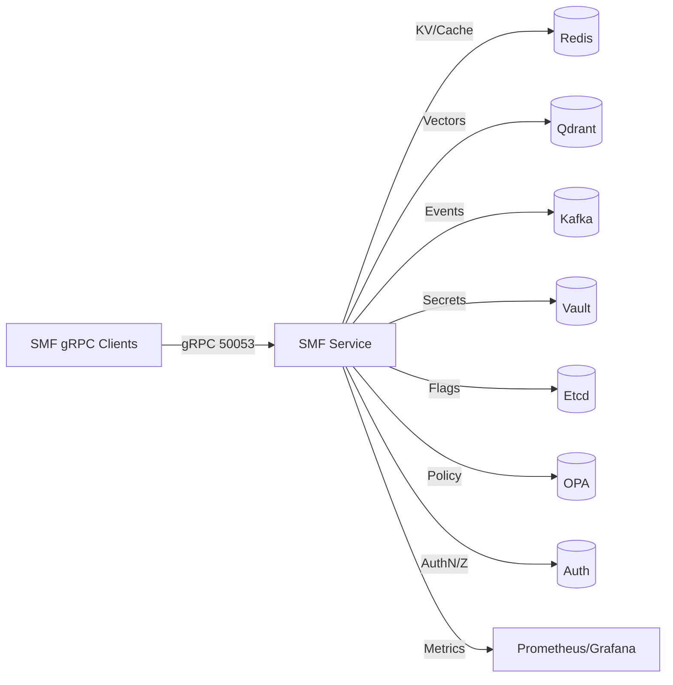

# Roadmap

> Alignment note: `docs/ARCHITECTURE_ROADMAP.md` remains the detailed task tracker for SomaStack integration. This file is the canonical roadmap for Soma Fractal Memory (SFM) core, security hardening, and deployment readiness.

## Roadmap Canonical (2025)

| Phase | Sprint | Goals | Key Deliverables |
|-------|--------|-------|------------------|
| 0. Foundations | 0A | Confirm architecture & principles | Architecture doc refresh, dependency graph, shared glossary |
| | 0B | Planning & guardrails | Sprint charters, risk register, KPIs (latency, ingest, MTTR) |
| | 0C | Shared infra playbook readiness | `scripts/reset-sharedinfra-compose.sh` upkeep, Kind cluster reset automation, image preload validation, sprint checkpoints documented |
| 1. Security & Access | 1 | Enforce auth + CORS + rate limits | Mandatory bearer auth, Redis-backed limiter, auth tests |
| | 2 | Secrets & TLS everywhere | Helm Secrets, TLS ingress + upstream, NetworkPolicy baseline |
| 2. Reliability & Data | 3 | Durable stores & migrations | Alembic baseline, Postgres retry logic, WAL recovery tests, Vault and ExternalSecret automation with Pgpool HA test harness |
| | 4 | Event pipeline resilience | Kafka idempotent producer, DLQ, consumer batch/backoff, observability, multi-broker bootstrap tooling |
| 3. Architecture Simplification | 5 | Dependency injection & modular stores | MemorySystemBuilder, extracted store package, factory cleanup |
| | 6 | Unified surfaces | HTTP/CLI/gRPC share runtime container, shared middleware, per-surface smoke tests |
| 4. Observability & Operations | 7 | Metrics, alerts, dashboards | ServiceMonitor/annotations, Grafana baseline, alert rules, `/stats` hardening, shared infra health snapshot + incident bundle automation |
| | 8 | CI/CD & automation | Nightly Kind + Helm run, security scan gates, migration drift checks, `make deploy-kind-full` CI gate |
| 5. Scale & Optionality | 9 | Hot tier + retention gates | Fast-core slab benchmarks, gating automation (G1–G3), retention tests, namespace access audits |
| | 10 | Production cutover | DR drill, runbooks, release handoff, final risk signoff, disaster recovery rehearsal evidence |

### Phase Outcomes
- **Security & Access**: API and gRPC surfaces require auth, secrets flow through managed stores, TLS enforced end-to-end, east-west access constrained.
- **Reliability & Data**: Migrations deterministic, retries/backoff standardized, Kafka pipeline tolerant to spikes, backups verified.
- **Architecture Simplification**: Core composed via explicit builders, no module-level singletons, surfaces share middleware and configs, docs up-to-date.
- **Observability & Ops**: Metrics collected centrally with dashboards/alerts, `/stats` resilient to backend churn, CI enforces drift checks.
- **Scale Options**: Fast core and retention features gated behind metrics, enabling production tuning without destabilizing base workloads.

### Shared infra playbook integration
- Foundations phase now tracks deterministic cluster reset, Kind provisioning, and image preload scripts as first-class roadmap items.
- Reliability phase sprints expand to cover Vault roles, ExternalSecrets, Pgpool HA verification, and Kafka multi-broker bootstrap jobs per playbook Sections 3 and 7.
- Observability phase incorporates health snapshot and incident bundle automation matching playbook Section 8, plus CI `make deploy-kind-full` gating.
- Scale phase extends to disaster recovery rehearsals and namespace access audits in line with playbook Section 11.
- Each addition maps to concrete sprint stories (docs, scripts, CI jobs) maintained alongside `docs/infra/sprints/` evidence.

### Next sprint (Sprint 3) focus
- Implement Vault and ExternalSecret flows for API and consumers, including rotation scripts and CI validation.
- Add Alembic migrations with retry/backoff across storage layers and reinforce `/stats` endpoint resilience.
- Begin Kafka resilience work: DLQ topic wiring, consumer lag metrics, and batch retry/backoff guards.
Once complete, update roadmap checkpoints and continue layering remaining playbook milestones through phases 4 and 5.

See `docs/ARCHITECTURE_ROADMAP.md` for task-level breakdowns, production-readiness mapping (Section 4), evidence requirements, and dependencies.
<!-- Canonical Roadmap for SomaFractalMemory (SFM) v2.1 -->

# SFM Canonical Roadmap (v2.1)

This document is the single source of truth for memory core evolution: math spec, principles, sprints, gating metrics, and deprecations. All future architectural changes MUST reconcile here.

## 0. Vision
Create the leanest, fastest, mathematically principled memory engine for Somabrain:
* Deterministic, auditable, reversible.
* Factorized scoring with bounded terms.
* Minimal dependencies and predictable latency from thousands to millions of memories.
* Complexity is justified only by measured improvement (latency / recall / footprint).

## 1. Principles
1. Simplicity first – no speculative abstraction.
2. Math integrity – explicit transformations, no hidden heuristics.
3. Observability over verbosity – aggregated metrics only.
4. Orthogonality – retrieval scoring ≠ retention policy.
5. Config contracts – safe defaults; advanced features require explicit flags.
6. Non‑destructive decay – use continuous factors; never mutate payloads to “age” them.
7. Truth tests only – no mock similarity; always real numeric operations.

## 2. Data Model (Internal)
| Field | Description |
|-------|-------------|
| id | Coordinate/UUID identifying memory |
| v | L2‑normalized vector (||v||₂ = 1) float32 |
| r | Raw importance (user/system supplied) |
| i | Normalized importance ∈ [0,1] |
| t_creation | Epoch creation time |
| t_access | Last access time (for retention) |
| access_count | Frequency counter (optional) |
| metadata | JSON‑safe dictionary |
| features F | Optional bounded feature channels f_j ∈ [0,1] (deferred) |

Contiguous slabs (fast core): V (N,D), I (N,), T (N,), optional A, C, ID mapping, capacity growth geometric.

## 3. Retrieval Math
Similarity (unit vectors): sim_raw = q·v; sim = max(0, sim_raw).
Importance normalization (logistic preferred): i = 1 / (1 + exp(-k(r-c))).
Importance exponent (later): i_adj = i^α (α=1 initial).
Decay (half‑life τ, disabled if τ=∞): decay = 2^{-Δt/τ}.
Feature channel (deferred): d = Π f_j^{w_j} with Σ w_j ≤ 1.
Final Score: Score = sim * i_adj * decay * d ∈ [0,1].
Log form for analysis: log Score = log(sim+ε) + α log i − (ln2/τ)Δt + Σ w_j log f_j.

## 4. Retention (Deferred)
RetentionScore R = γ₁ i_adj + γ₂ 2^{-(T_now−t_access)/τ_r} + γ₃ log(1+c)/log(1+C_max) − γ₄ cost.
Activated only when scale gates trip.

## 5. Hot Path Complexity
Flat index query: O(ND + N) (matmul + elementwise scaling + partial selection).
Top‑k: argpartition (O(N)) + local sort (k log k).

## 6. Deprecations
| Legacy | Status | Replacement |
|--------|--------|-------------|
| Destructive decay threads | Deprecated | Half‑life multiplicative factor |
| Constant score in-memory search | Deprecated | Real cosine + importance scaling |
| Raw importance ranking | Deprecated | Normalized importance i |
| Mutation-based pruning | Deprecated | Retention score (later) |

## 7. Gating Conditions
| Gate | Condition | Action |
|------|-----------|--------|
| G1 | N>200k & p95>25ms | Introduce hot tier + retention score |
| G2 | Importance skew extreme | Enable α tuning |
| G3 | Frequent top‑k ties | Add sim exponent β |
| G4 | Memory pressure | Float16 / projection |
| G5 | ANN backend | Residual penalty factor |
| G6 | Product needs aging | Enable τ half‑life |

## 8. Sprints (Rapid)
### Sprint 1 (Current)
* Enforce normalization @ insert.
* Real cosine similarity in in‑memory path.
* Importance normalization (min–max bootstrap → logistic later).
* Score = sim * i (decay stub = 1).
* Truth tests: norms, similarity monotonicity, clamp non‑negative.

### Sprint 2
* Contiguous slab arrays (V,I,T,ID) + direct matmul query path.
* Microbenchmark (N=5k,10k; k=5,10) p50/p95 capture.
* Replace legacy constant-scoring search fully.

### Sprint 3
* τ parameter + optional half‑life activation.
* Decay correctness tests (Δt=τ → ≈0.5).
* Latency regression guard (<5%).

### Sprint 4 (Conditional G1)
* RetentionScore implementation (no eviction until flagged enable).
* Synthetic evaluation for ordering.

### Sprint 5 (Conditional)
* Hot tier + eviction, metrics (hot_hit_ratio, promotions).

### Sprint 6 (Conditional)
* Float16 option + recall test.
* Projection / ANN adapters + residual penalty.

## 9. Metrics
total_vectors, insert_qps, query_qps, p50/p95 latency, norm_error_max, importance quantiles, decay_active%, (later) hot_tier_hit_ratio, eviction_count.

## 10. Test Matrix
| Test | Purpose | Sprint |
|------|---------|--------|
| test_norm_invariant | Vector normalization | 1 |
| test_similarity_monotonicity | Ranking correctness | 1 |
| test_zero_similarity_clamp | Safety | 1 |
| test_importance_present | Importance norm field set | 1 |
| test_half_life_halving | Decay correctness | 3 |
| test_retention_ordering | Retention math | 4 |
| test_float16_recall | Precision impact | 6 |

## 11. Risks & Mitigation
| Risk | Mitigation |
|------|------------|
| Importance shock | Log pre/post top‑k diff, fallback flag |
| Latency regression | Benchmark per sprint; rollback threshold 5% |
| Over‑eager retention | Gate by metrics (G1) |
| Approx recall loss | Residual penalty + recall@k baseline |

## 12. Acceptance (Core v2 Completion)
* Score pipeline stages 1–3 merged and tested.
* Benchmarks reproducible and documented.
* No destructive payload mutation for aging.
* Separation of retrieval & retention concerns codified.
* Roadmap kept synchronized with code changes.

---
Change Log:
* v2.1 (initial canonical roadmap committed) – Sprint 1 initialization.

---

## 13. Soma Stack Compliance & Integration Roadmap (SMF)

Objective

Align SomafractalMemory (SMF) with the revised, shared‑infrastructure Soma stack architecture:

- Use common infra services (Auth, OPA, Kafka, Redis, Prometheus/Grafana, Vault, Etcd).
- Communicate with other components via gRPC (memory.proto).
- Adopt an async‑first design pattern across the service.
- Centralize configuration, logging, and tracing via `common/` utilities.
- Deploy via the unified Helm stack and run CI/CD that spins up the full stack for integration tests.

No‑mock policy

WARNING: This project does NOT allow mocking, mimicking, or changing production values for tests. All agents must operate against real configurations and real services. Any test that requires altering live settings is prohibited. Use dedicated test environments and real data fixtures instead.

Scope and current baseline

- Present in code:
	- Centralized settings module (`common/config/settings.py`), infra DNS defaults, logging/tracing helpers exist.
	- gRPC artifacts present (`proto/memory.proto`, generated stubs, async and sync servers present).
	- Async consumer pipeline (`aiokafka`) and Prometheus metrics for API and consumer.
- Missing/partial:
	- Core/factory still synchronous; API primarily HTTP; gRPC port not standardized/exposed; Vault/etcd not wired; cache layer not integrated; Helm sub‑chart and CI full‑stack pipeline not landed.

Mermaid overview



Milestones (2‑week sprints)

Sprint 1 – Config centralization & Vault integration

- Status: [TODO] – blocked on Sprint 0 documentation updates and compose parity notes.
- Tasks
	- Refactor API/factory to consume `SMFSettings` from `common/config/settings.py` (single source of truth, env prefix SOMA_).
	- Remove `.env` reliance in runtime paths; document Vault Agent injection and mount points; add Vault annotations to manifests.
	- Default endpoints to cluster DNS (e.g., `redis.soma.svc.cluster.local`) with compose overrides for local.
- Acceptance
	- API starts with only settings file + env; no `.env` needed.
	- Helm values default to DNS; Vault paths configurable; docs updated.

Sprint 2 – gRPC definition & async refactor (core)

- Status: [TODO] – pending completion of async refactor design and Sprint 1 settings work.
- Tasks
	- Standardize gRPC port 50053 across code/docs; expose in Dockerfile/compose/helm.
	- Make gRPC server primary; mark HTTP example as auxiliary.
	- Convert I/O in core/factory to async; add thin sync adapters if required.
	- Update CLI to run with `asyncio.run` when contacting async backends.
- Acceptance
	- grpcurl health check passes; basic CRUD round‑trip via gRPC; core critical paths run under asyncio.

Sprint 3 – Logging/Tracing & Docker/Helm

- Status: [TODO] – requires logging/tracing consolidation and Dockerfile refresh.
- Tasks
	- Replace ad-hoc tracing with `common/utils/trace.py`; export to Jaeger via settings.
	- Switch logging to `common/utils/logger.py` JSON logger with consistent fields.
	- Dockerfile: base `python:3.12-slim`, expose 50053, gRPC healthcheck.
	- Promote Helm: serviceAccount + minimal RBAC; Vault annotations; support `global.imageTag`; default to shared DNS.
- Acceptance
	- Traces visible in Jaeger; logs structured; helm lint passes; deployment uses SA/RBAC and picks up global image tag.

Sprint 4 – CI/CD full-stack & cache

- Status: [TODO] – dependent on shared infra Helm chart and GitHub Action scaffolding.
- Tasks
	- GitHub Actions: setup-kind; install soma-stack; run integration tests; run `helm lint`; cache generated gRPC stubs.
	- Integrate `common/utils/redis_cache.py` on hot read paths with 5-minute TTL; configure via settings.
- Acceptance
	- CI green end‑to‑end on Kind; cache hit ratio visible; latency improved for hot keys.

Sprint 5 – Feature flags (etcd) & full integration tests

- Status: [TODO] – waiting on etcd client wiring and async test harness.
- Tasks
	- Wire `common/utils/etcd_client.py` feature flags; background watcher (Kafka `config.updates`).
	- Write pytest-asyncio gRPC unit tests; add full-stack tests (Auth/OPA/Kafka/Redis/Etcd) with latency SLO (<50 ms per call under dev load).
- Acceptance
	- Flags toggle behaviors without restarts; tests validate latency and contract.

Sprint 6 – Documentation & run-book

- Status: [TODO] – final sprint once infra and core integrations are complete.
- Tasks
	- Add `docs/runbook_smf.md` with deployment steps, health/rollback, and gRPC usage.
	- Update architecture with shared-infra section and gRPC contract; add "no-mock" banner to index/quickstart.
	- Add k6 load script and Vault secrecy checks to the repo.
- Acceptance
	- Docs reviewed/green; run‑book reproducible; load/secrecy checks integrated into CI optional stage.

Gating metrics & risks (integration)
---

# SomaStack Shared Infra — Agent Deployment Playbook (Canonical)

Scope: Canonical manual for automation agents (Codex, Copilot, GitOps) to deploy workloads into Soma shared infra. Deterministic, restart‑resistant, with explicit commands and validation.

Order of operations: Docker setup first where applicable (images, uv, local validation), then Kubernetes shared infra provisioning, then app wire‑up.

## 0. Cluster Reset Checklist
```sh
helm uninstall sharedinfra -n soma-infra || true
kubectl delete namespace soma-infra --wait=false || true
kubectl wait --for=delete ns/soma-infra --timeout=120s || true
kubectl get namespaces
```
If `soma-infra` is stuck `Terminating`, clear finalizers:
```sh
kubectl get namespace soma-infra -o json | jq '.spec.finalizers=[]' | \
	kubectl replace --raw /api/v1/namespaces/soma-infra/finalize -f -
```

## 1. Environment Bootstrap
Tools (minimum versions): kubectl ≥1.28, helm ≥3.13, kind ≥0.22, docker ≥24.0, jq ≥1.6.
Validate binaries:
```sh
kubectl version --client && helm version && kind version && docker version && jq --version
```
Kind cluster:
```sh
kind delete cluster --name soma || true
kind create cluster --name soma --config infra/kind/soma-kind.yaml
kubectl config use-context kind-soma
```
Preload images:
```sh
for img in bitnamicharts/postgresql-repmgr:17.6.0-debian-12-r2 \
					 bitnamicharts/pgpool:4.6.3-debian-12-r0 \
					 apache/kafka:3.8.0 \
					 redis:7.2.4-alpine \
					 hashicorp/vault:1.15.4 \
					 openpolicyagent/opa:0.57.0-debug \
					 prom/prometheus:v2.47.2 \
					 grafana/grafana:10.2.3; do
	docker pull "$img" && kind load docker-image "$img" --name soma
done
```

## 2. Shared Infra Deployment
```sh
helm dependency update infra/helm/soma-infra
kubectl create namespace soma-infra || true
helm upgrade --install sharedinfra infra/helm/soma-infra \
	-n soma-infra -f infra/helm/soma-infra/values-dev.yaml \
	--wait --timeout 5m
kubectl wait --for=condition=ready pod --all -n soma-infra --timeout=180s
helm status sharedinfra -n soma-infra
```
Postgres HA check, see full playbook above.

Overlays: select via `-f values-<mode>.yaml` (dev/test/staging/prod-lite/prod). Always `--wait`.

Mermaid snapshot included in full playbook.

## 3. Application Wire‑Up Workflow
- Namespace labeling
- Vault role + policy, ExternalSecret (per app ns)
- ConfigMap contract (DNS for shared services)
- Deployment skeleton (Helm)
- Database provisioning (Pgpool)
- Kafka topic setup (partitions per env)

Commands and YAML templates provided in the playbook above.

## 4. CD Pipeline Blueprint
GitHub Actions template included (build, push, helm upgrade, readiness gate). Enforce identical readiness checks across environments.

## 5. Verification Matrix & Troubleshooting
Command→criteria table provided; incident bundle collector script included.

## 6. Policies
No mocking; restart resilience; drift detection; access control via namespace label + NetworkPolicies.

---

# Consolidated Execution Roadmap (Parallel Sprints Enabled)

This section unifies code refactor sprints with production‑readiness and the shared‑infra onboarding playbook. Sprints can run in parallel where they touch disjoint areas.

Sprint 0 — Guardrails (CI reports) [parallel]
- MkDocs build + link checks; dead‑code/dep reports; decide on generated artifacts policy.

Sprint 1 — Structure cleanup [parallel]
- Remove duplicate workers; unify package layout; .gitignore hygiene; relocate stray tests.

Sprint 2 — Config & DI simplification
- Central Settings; inject at boundaries; uniform logging; explicit retries/backoff.

Sprint 3 — Docs & ergonomics
- One roadmap doc; scripts index; normalized terminology; generated vs committed clarified.

Sprint 4 — Packaging & runtime
- Dockerfiles on uv; slim images; SBOM; enforce CI gates.

Sprint 5 — Correctness & performance
- Pydantic v2 cleanup; perf/load tests; RED dashboards and targets.

Sprint 6 — Security & production hardening
- Secrets via files; TLS/Ingress; NetworkPolicies; scans; Helm defaults (resources/HPA/PDB).

Shared‑Infra Onboarding (Kubernetes)
- Reset → Bootstrap → Deploy infra → App wire‑up → CD → Verification → Ops.

Cutover & Merge Playbook
- Complete Sprints 1–3; run Sanity CI; update CHANGELOG; tag release; deploy to staging with readiness gates; smoke and promote.
- SLOs: p95 gRPC store/recall < 50 ms on dev Kind; zero secret leakage; CI full‑stack < 25 min.
- Risks: Async refactor regressions → dual path adapters; Vault/etcd availability → fallback to safe defaults with clear warnings; Helm drift → lint + schema checks.
