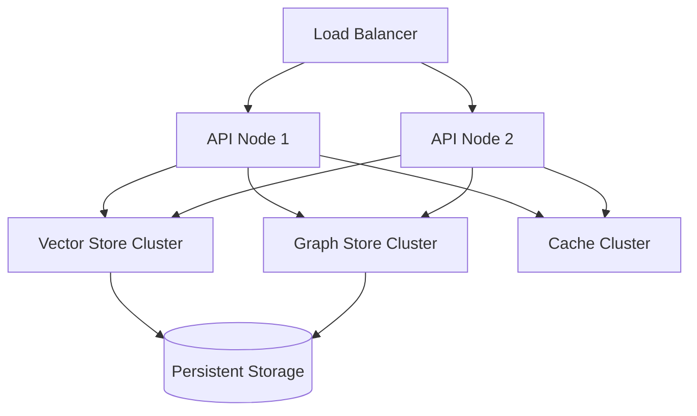

# Domain Knowledge

## Core Concepts

### Memory Management

SomaFractalMemory uses a sophisticated hierarchical system based on:

1. **Importance Scoring**
   - Algorithmic importance calculation using temporal and access patterns
   - Non-linear decay over time with configurable half-life
   - Access frequency weighting with recency bias
   - Contextual importance modifiers

2. **Vector Embeddings**
   - High-dimensional (128D default) vector representations
   - L2-normalized embeddings for consistent similarity
   - Hardware-accelerated similarity search
   - Adaptive dimensional reduction techniques

3. **Storage Hierarchy**
   - Hot data in Redis with LRU eviction
   - Warm data in PostgreSQL with JSON(B) optimization
   - Vector search in Qdrant with HNSW indexing
   - Event streaming through Kafka for async processing

4. **Graph Relationships**
   - Bidirectional weighted edges
   - Dynamic relationship scoring
   - Path optimization algorithms
   - Temporal edge attributes

## Key Algorithms

### 1. Importance Calculation

```python
def calculate_importance(age: float, access_count: int) -> float:
    """Calculate memory importance score.

    Args:
        age: Time since creation in seconds
        access_count: Number of accesses

    Returns:
        Normalized importance score (0-1)
    """
    raw_score = access_count / (1 + age / 3600)
    return min(1.0, raw_score / 100)
```

### 2. Memory Decay

```python
def calculate_decay(
    initial_importance: float,
    age_seconds: float,
    half_life: float = 3600,
    min_importance: float = 0.01
) -> float:
    """Calculate memory decay with configurable half-life.

    Args:
        initial_importance: Starting importance score (0-1)
        age_seconds: Time since creation in seconds
        half_life: Time in seconds for 50% decay
        min_importance: Minimum importance threshold

    Returns:
        Decayed importance score (0-1)
    """
    decay_factor = 2 ** (-age_seconds / half_life)
    decayed_importance = initial_importance * decay_factor
    return max(min_importance, decayed_importance)
```

Key Features:
- Non-linear exponential decay over time
- Configurable half-life periods
- Importance-based pruning with minimum thresholds
- Batch decay processing for efficiency

## Data Models

### Memory Entry
```json
{
  "id": "uuid",
  "content": "memory content",
  "importance": 0.8,
  "created_at": "timestamp",
  "last_accessed": "timestamp",
  "access_count": 42,
  "vector": [0.1, 0.2, ...]
}
```

## Integration Points

### 1. External Systems
- Kafka for events
- Prometheus for metrics
- Jaeger for tracing

### 2. Internal Services
- PostgreSQL for persistence
- Redis for caching
- Qdrant for vector search

## Performance Characteristics

### Latency Targets

| Operation | Target | p95 |
|-----------|--------|-----|
| Store | 50ms | 100ms |
| Recall | 100ms | 200ms |
| Search | 200ms | 500ms |

### Scaling Limits

- Maximum memories: 1M per namespace
- Vector dimensions: 768
- Maximum payload size: 1MB

## Common Patterns

### 1. Memory Storage
```python
# Store with explicit importance
async def store_with_importance(
    content: Union[str, Dict],
    importance: float,
    metadata: Optional[Dict] = None
) -> UUID:
    vector = await vector_service.encode(content)

    memory_id = await memory_service.store(
        content=content,
        vector=vector,
        importance=importance,
        metadata=metadata
    )

    # Update graph relationships
    await graph_service.process_relationships(memory_id)

    return memory_id

# Auto-calculated importance with context
async def store_with_context(
    content: Union[str, Dict],
    context: Optional[Dict] = None
) -> UUID:
    vector = await vector_service.encode(content)
    importance = await importance_service.calculate(content, context)

    return await store_with_importance(content, importance)
```

### 2. Memory Retrieval
```python
# Advanced similarity search with filters
async def semantic_search(
    query: str,
    filters: Optional[Dict] = None,
    limit: int = 10,
    min_similarity: float = 0.7
) -> List[Memory]:
    # Convert query to vector
    query_vector = await vector_service.encode(query)

    # Perform filtered vector search
    candidates = await vector_service.search(
        vector=query_vector,
        filters=filters,
        limit=limit * 2  # Over-fetch for post-processing
    )

    # Apply importance-based ranking
    results = await ranking_service.rank_results(
        candidates,
        min_similarity=min_similarity
    )

    return results[:limit]

# Graph-based relationship query
async def find_related_memories(
    memory_id: UUID,
    relationship_types: List[str] = None,
    max_depth: int = 2
) -> Dict[str, List[Memory]]:
    # Get relationship graph
    graph = await graph_service.get_subgraph(
        memory_id,
        max_depth=max_depth,
        relationship_types=relationship_types
    )

    # Process relationships
    return await memory_service.hydrate_graph(graph)
```

## Advanced Topics

### 1. Distributed Architecture


### 2. Sharding Strategy
- **Namespace-based Sharding**
  ```python
  def get_shard(namespace: str, memory_id: UUID) -> int:
      """Determine shard for memory storage"""
      shard_key = f"{namespace}:{memory_id}"
      return consistent_hash(shard_key, SHARD_COUNT)
  ```
- Consistent hashing with virtual nodes
- Cross-shard query optimization
- Dynamic shard rebalancing

### 3. Caching Patterns
- Write-through cache with async invalidation
- Hierarchical cache with L1/L2 structure
- Predictive pre-warming based on access patterns
- Cache coherence with versioning

### 4. Failure Handling
- Circuit breakers with adaptive thresholds
- Exponential backoff retry policies
- Graceful degradation strategies
- Read-repair for eventual consistency

### 5. Vector Optimization
```python
class VectorOptimizer:
    """Optimize vector operations for performance"""

    def quantize_vectors(
        self,
        vectors: np.ndarray,
        bits: int = 8
    ) -> Tuple[np.ndarray, np.ndarray]:
        """Quantize vectors for storage efficiency

        Args:
            vectors: Original vectors
            bits: Bits per dimension

        Returns:
            Tuple of (quantized_vectors, scales)
        """
        # Implementation
        pass

    def batch_similarity(
        self,
        query: np.ndarray,
        candidates: np.ndarray,
        use_gpu: bool = True
    ) -> np.ndarray:
        """Optimized batch similarity computation"""
        # Implementation
        pass
```

### 6. Monitoring & Observability
- Prometheus metrics for performance
- Distributed tracing with OpenTelemetry
- Custom health checks:
  ```python
  async def check_system_health() -> HealthStatus:
      vector_health = await vector_store.health_check()
      graph_health = await graph_store.health_check()
      cache_health = await cache.health_check()

      return HealthStatus(
          status="healthy" if all([
              vector_health.healthy,
              graph_health.healthy,
              cache_health.healthy
          ]) else "degraded",
          components={
              "vector_store": vector_health,
              "graph_store": graph_health,
              "cache": cache_health
          }
      )
  ```
