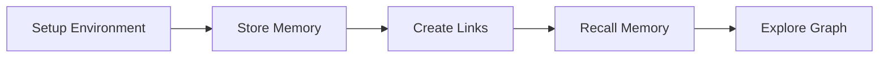
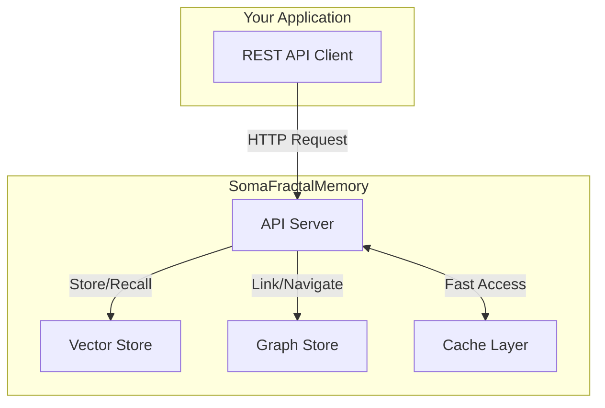
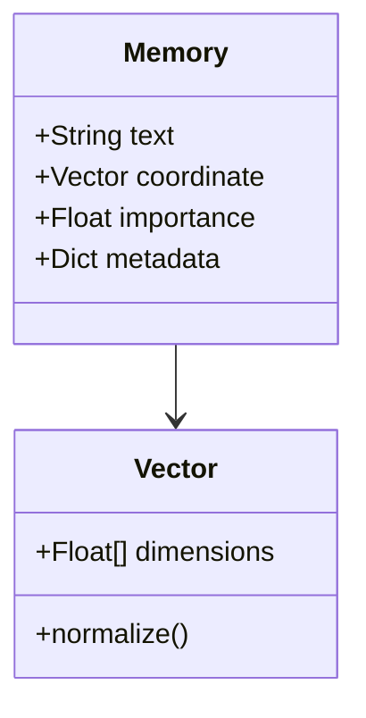
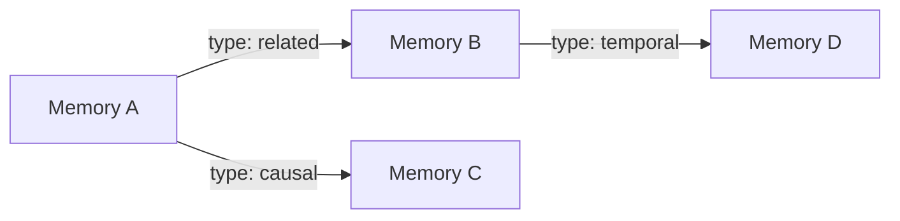
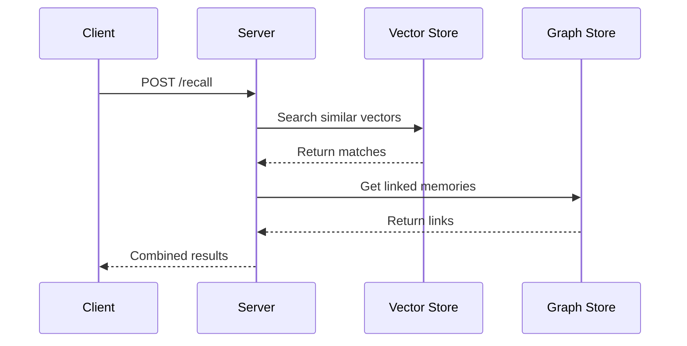
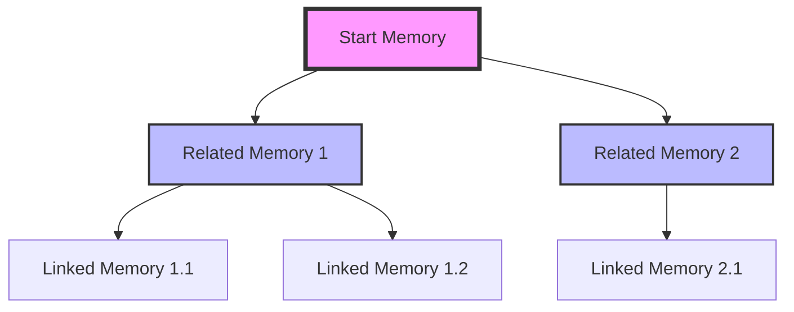
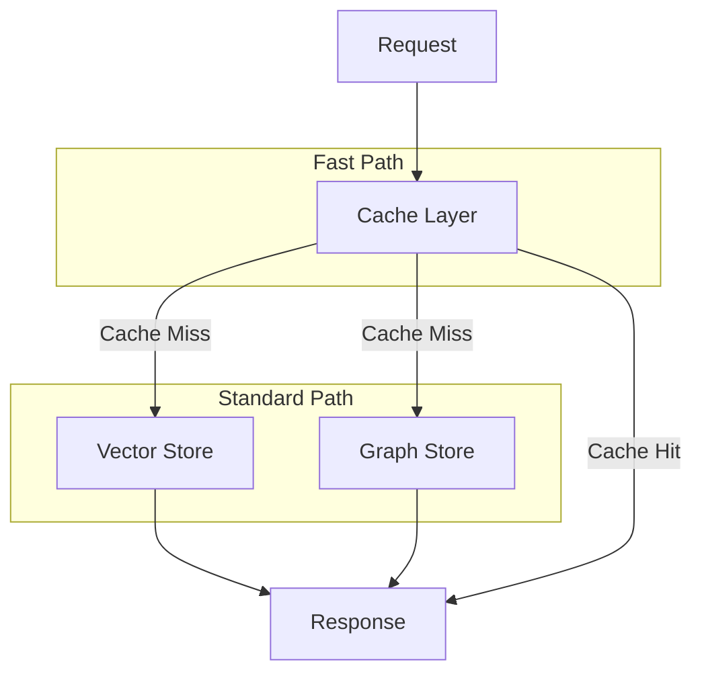
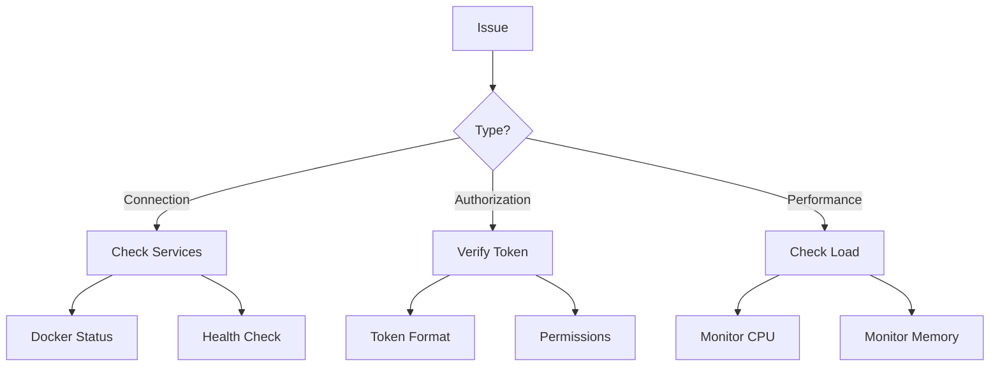

# Getting Started with SomaFractalMemory

## Overview

This tutorial will guide you through setting up SomaFractalMemory and performing basic operations.



## System Architecture

Before we begin, let's understand how the components interact:



## Step 1: Setting Up Your Environment

1. Start the services:
   ```bash
   docker compose up -d
   ```

   System status diagram:
   ```mermaid
   stateDiagram-v2
   [*] --> Starting
   Starting --> Initializing: Services Starting
   Initializing --> Ready: Health Checks Pass
   Ready --> [*]
   ```

2. Verify the system is ready:
   ```bash
   curl http://localhost:9595/health
   ```

## Step 2: Storing Your First Memory

### Memory Structure


### Example Request
```bash
curl -X POST http://localhost:9595/store \
  -H "Authorization: Bearer YOUR_TOKEN" \
  -H "Content-Type: application/json" \
  -d '{
    "coord": "1.0,2.0,3.0",
    "payload": {
      "text": "My first memory",
      "type": "episodic"
    },
    "importance": 0.8
  }'
```

## Step 3: Creating Memory Links

### Link Structure


### Example Link Creation
```bash
curl -X POST http://localhost:9595/link \
  -H "Authorization: Bearer YOUR_TOKEN" \
  -H "Content-Type: application/json" \
  -d '{
    "from_coord": "1.0,2.0,3.0",
    "to_coord": "4.0,5.0,6.0",
    "type": "related",
    "weight": 1.0
  }'
```

## Step 4: Memory Recall

### Recall Process


### Example Recall
```bash
curl -X POST http://localhost:9595/recall \
  -H "Authorization: Bearer YOUR_TOKEN" \
  -H "Content-Type: application/json" \
  -d '{
    "query": "first memory",
    "top_k": 5
  }'
```

## Step 5: Exploring the Memory Graph

### Graph Navigation


### Finding Neighbors
```bash
curl "http://localhost:9595/neighbors?coord=1.0,2.0,3.0" \
  -H "Authorization: Bearer YOUR_TOKEN"
```

## Performance Considerations

### Memory Access Patterns


### Response Times
| Operation | Typical Latency |
|-----------|----------------|
| Store | < 100ms |
| Recall | < 50ms |
| Link | < 30ms |
| Neighbor Query | < 20ms |

## Next Steps
- [Advanced Features](../features/index.md)
- [API Reference](../../development-manual/api-reference.md)
- [Performance Tuning](../../technical-manual/performance.md)

## Troubleshooting

### Common Issues


### Status Codes
| Code | Meaning | Solution |
|------|----------|----------|
| 401 | Invalid token | Check authorization header |
| 404 | Memory not found | Verify coordinates |
| 429 | Rate limit | Reduce request frequency |

## Support Resources
- [Community Forum](https://community.somafractalmemory.com)
- [GitHub Issues](https://github.com/yourusername/somafractalmemory/issues)
- [API Status](https://status.somafractalmemory.com)
